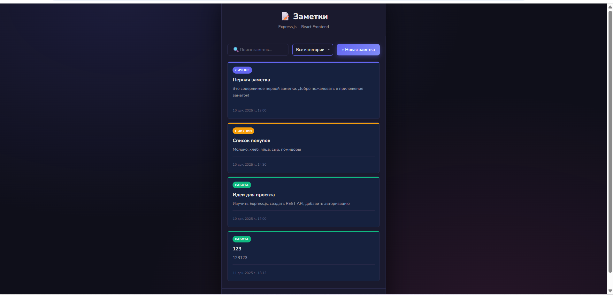
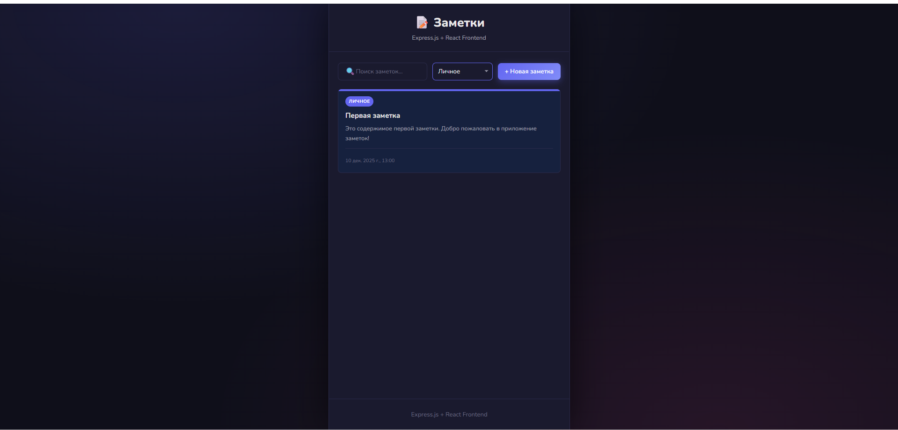
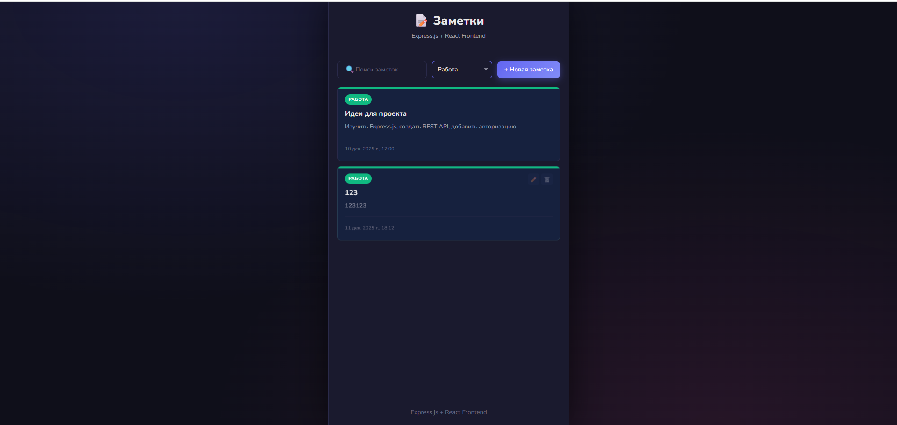
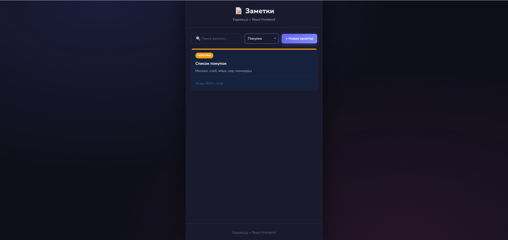
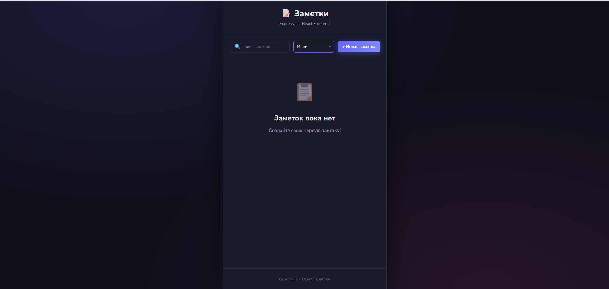
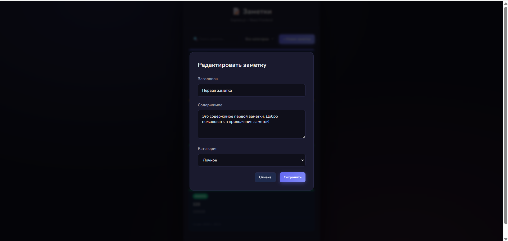
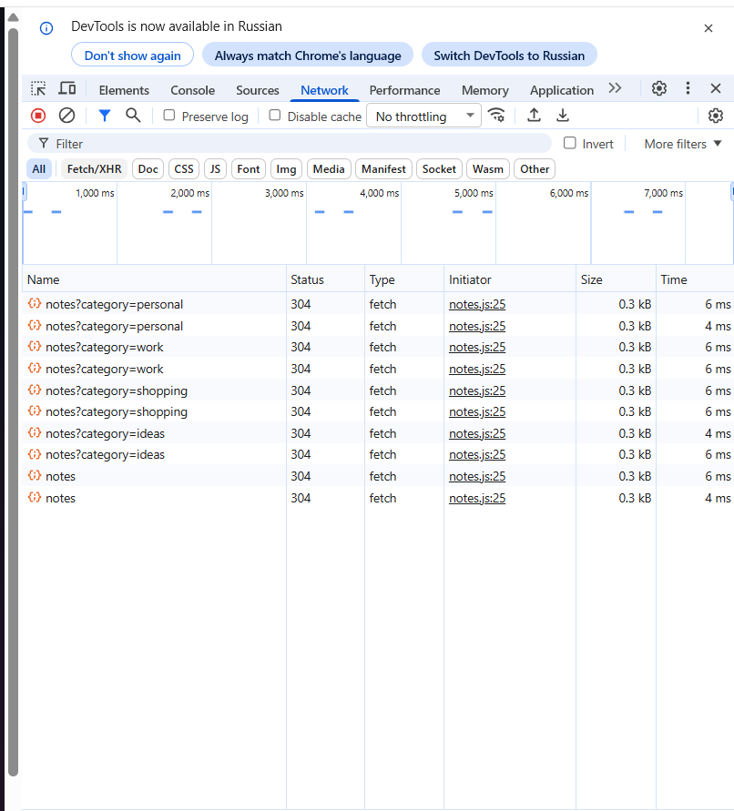

# Notes App (Express + React)

Небольшое приложение для заметок: REST API на Express, фронтенд на React/Vite.

## Возможности
- CRUD заметок
- Поиск по заголовку и тексту
- Фильтр по категории

## Структура
```
kp-5/
├─ server/           // backend (Express)
│  ├─ index.js
│  ├─ routes/
│  ├─ controllers/
│  ├─ middleware/
│  └─ data/notes.json
├─ src/              // frontend (React)
│  ├─ api/
│  ├─ components/    // каждая папка = компонент (.jsx + .scss)
│  ├─ pages/
│  ├─ shared/
│  ├─ styles/        // base.scss, buttons.scss
│  ├─ App.jsx
│  └─ main.jsx
└─ package.json
```

## Запуск
```bash
npm install

# терминал 1: сервер
npm run server

# терминал 2: фронт
npm run dev
# открыть http://localhost:5173
```

### Swagger-lite
**Base URL:** `http://localhost:3000/api/notes`

- **GET /**  
  - Query: `category` (string, optional)  
  - 200: `{ success: true, data: Note[] }`

- **GET /search**  
  - Query: `q` (string, required)  
  - 200: `{ success: true, data: Note[] }`  
  - 400: `{ success: false, error }`

- **GET /:id**  
  - Params: `id` (number)  
  - 200: `{ success: true, data: Note }`  
  - 404: `{ success: false, error }`

- **POST /**  
  - Body: `{ title: string, content: string, category?: string }`  
  - 201: `{ success: true, data: Note }`  
  - 400: `{ success: false, error }`

- **PUT /:id**  
  - Body: частичное обновление `{ title?, content?, category? }`  
  - 200: `{ success: true, data: Note }`  
  - 404: `{ success: false, error }`

- **DELETE /:id**  
  - 200: `{ success: true, data: Note }`  
  - 404: `{ success: false, error }`

Тип `Note`:  
`{ id: number, title: string, content: string, category: 'personal' | 'work' | 'shopping' | 'ideas', createdAt: string }`

## Стек
- Backend: Express
- Frontend: React, Vite, SCSS (`sass-embedded`)

## Демонстрация



Категории:





Модальное окно для редактирования:


Демострация в devtools'ах (Network) дергание ручек бекэнда

